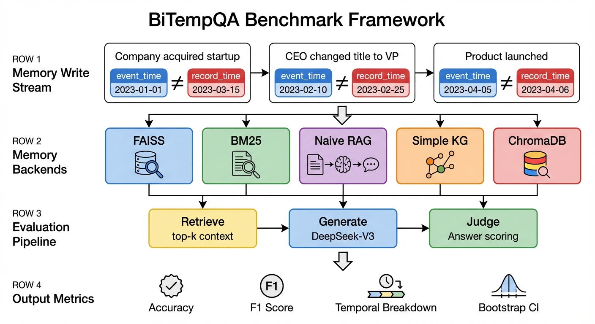
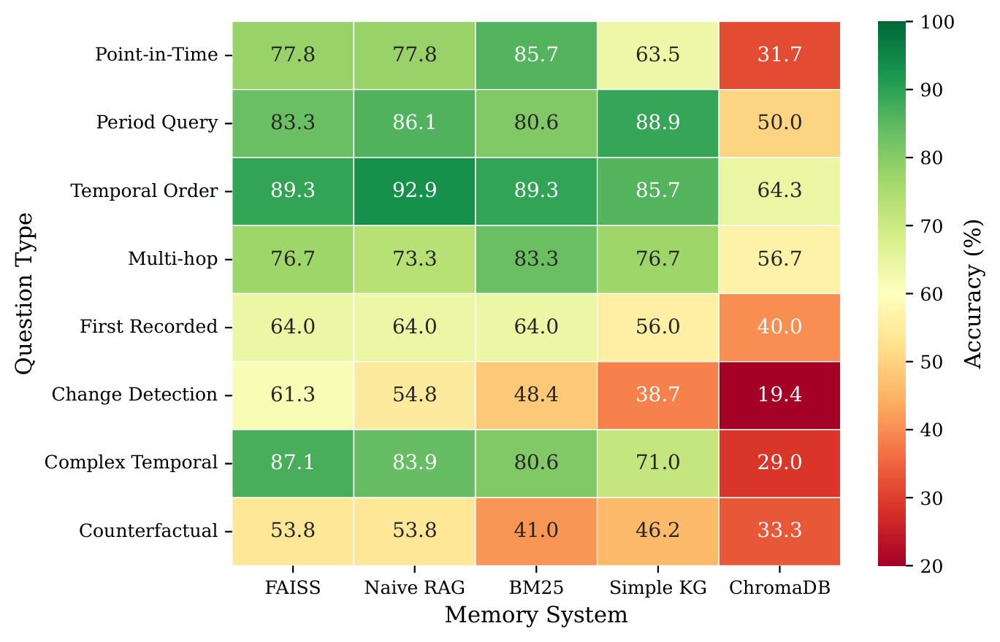
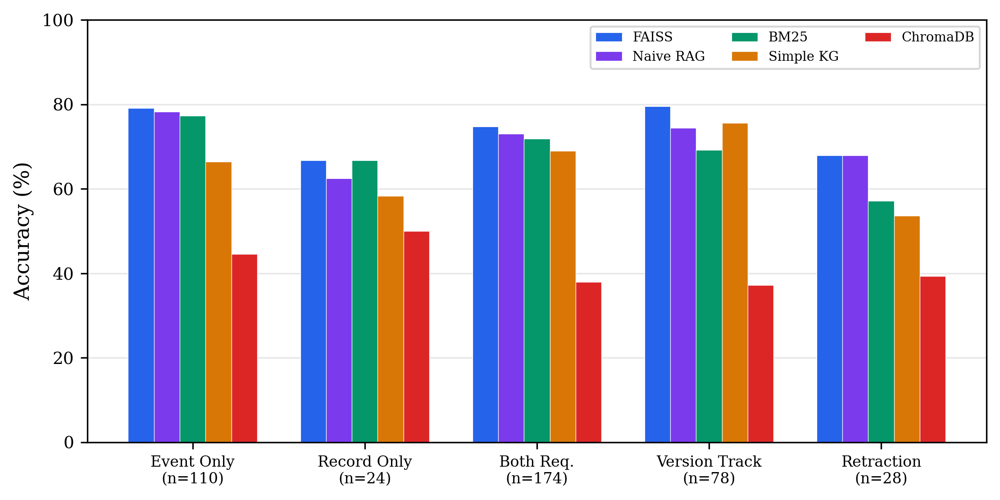
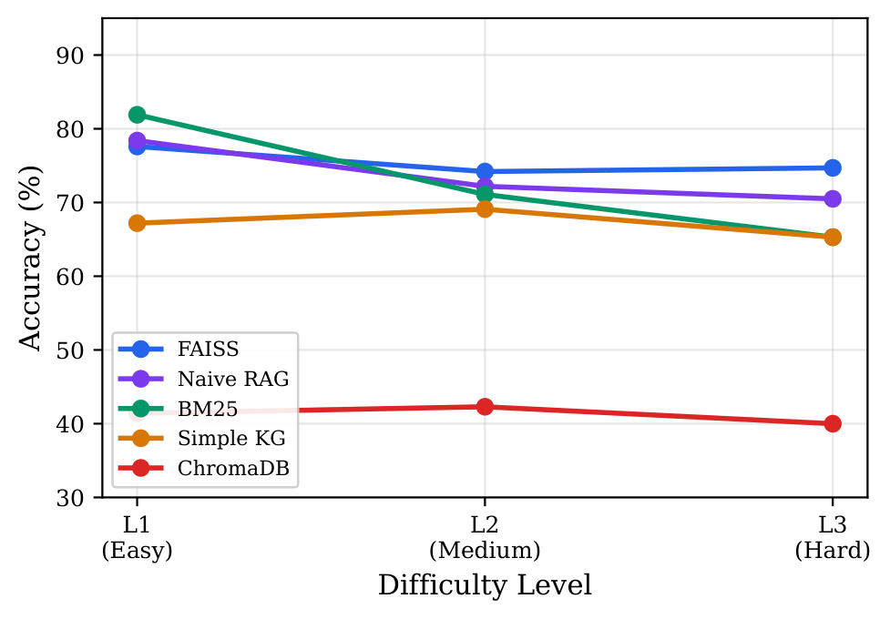
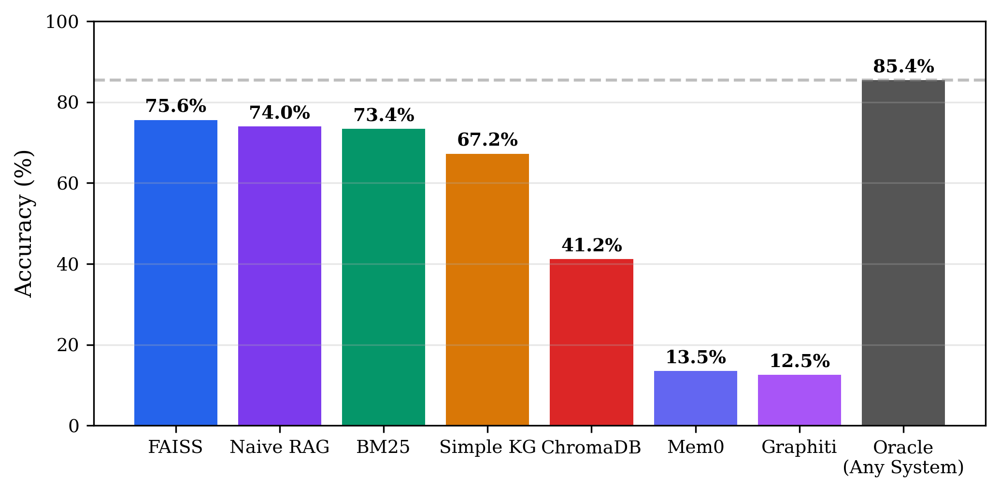
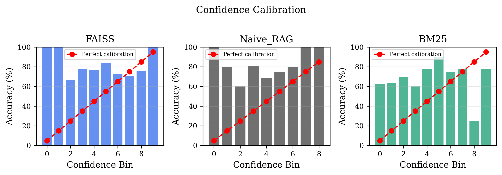

<div align="center">

# BiTempQA

### A Diagnostic Benchmark for Bitemporal Reasoning in LLM Agent Memory Systems

[](paper/main.pdf)
[](https://huggingface.co/datasets/heihei/BiTempQA)
[](LICENSE)

**1,536 Chinese QA pairs (308 test) | 10 scenario types | 9 question types | 5 memory backends**

</div>

---

## Overview

Memory-augmented LLM agents must track not only **what** happened but **when** it happened and **when they learned about it**. This dual-timestamp (bitemporal) distinction is critical for real-world applications such as medical records, financial systems, and news analysis.

**BiTempQA** is the first benchmark explicitly designed to evaluate bitemporal reasoning in LLM agent memory systems. Every memory entry carries explicit `event_time` (when something occurred) and `record_time` (when the system stored it) annotations. Over half (56.5%) of questions require reasoning about **both** timestamps simultaneously.

<div align="center">


*BiTempQA framework: Each memory write carries dual timestamps. Five memory backends retrieve context through a unified Retrieve -> Generate -> Judge pipeline.*
</div>

---

## Key Features

| Feature | Detail |
|---------|--------|
| **Dual-timestamp annotations** | Every memory entry has `event_time` + `record_time` |
| **56.5% bitemporal questions** | Over half require reasoning about both timestamps |
| **10 scenario types** | Entity evolution, late-arriving facts, knowledge retraction, etc. |
| **9 question types @ 3 levels** | L1 (easy) to L3 (hard), including counterfactual and version conflict |
| **5 memory backends** | FAISS, BM25, Naive RAG, Simple KG, ChromaDB |

---

## Dataset

The dataset is available on HuggingFace: **[heihei/BiTempQA](https://huggingface.co/datasets/heihei/BiTempQA)**

### Dataset Splits

| Split | Scenarios | QA Pairs |
|-------|-----------|----------|
| Train | 120 | 1,075 |
| Dev | 87 | 153 |
| Test (held-out) | 112 | 308 |
| **Total** | **120** | **1,536** |

### Dual-Timestamp Composition (Test Set)

| Temporal Requirement | Count | Example |
|---------------------|-------|---------|
| Both timestamps required | 174 (56.5%) | "Did the system know X when Y happened?" |
| Event-time only | 110 (35.7%) | "When did event X occur?" |
| Record-time only | 24 (7.8%) | "When was fact X first recorded?" |

### Scenario Types

1. Entity Attribute Evolution
2. Relationship Evolution
3. Contradictory Information
4. Late-Arriving Facts
5. Future-Dated Information
6. Entity Identity Resolution
7. Knowledge Retraction
8. Multi-Source Information
9. Gradual Accumulation
10. Temporal Ambiguity

---

## Main Results

### Overall Performance (Test Set, n=308)

| System | Accuracy | F1 | 95% CI |
|--------|----------|-----|--------|
| **FAISS** | **75.6%** | **0.870** | [70.8, 80.2] |
| Naive RAG | 74.0% | 0.867 | [69.2, 78.9] |
| BM25 | 73.4% | 0.867 | [68.2, 78.2] |
| Simple KG | 67.2% | 0.841 | [61.7, 72.4] |
| ChromaDB | 41.2% | 0.744 | [35.7, 46.8] |

> Top 3 systems are statistically tied (p>0.3, McNemar's test), but diverge sharply on specific question types (40.6pp spread).

### Per-Question-Type Breakdown

<div align="center">


*System x Question Type accuracy. No single system dominates all types.*
</div>

### Record-Time Reasoning Is Genuinely Harder

A mixed-effects logistic regression confirms record-time reasoning is harder than event-time reasoning (**p=0.023**), controlling for question type, difficulty, and scenario variation.

<div align="center">


*Accuracy by temporal requirement. Record-only questions (n=24) are hardest across all systems.*
</div>

### Difficulty Calibration

<div align="center">


*FAISS is most robust to difficulty increase (-2.9pp); BM25 is most fragile (-16.6pp).*
</div>

### System Complementarity

<div align="center">


*Oracle ensemble reaches 85.4% vs. 75.6% best single system (+9.8pp). 45 irreducible failures remain.*
</div>

### Cross-Benchmark: LoCoMo

| System | BiTempQA | LoCoMo Overall | LoCoMo Temporal | LoCoMo Adversarial |
|--------|----------|---------------|-----------------|-------------------|
| FAISS | **75.6%** | **57.0%** | **46.9%** | 63.0% |
| Simple KG | 67.2% | 56.8% | 37.5% | **97.5%** |

> Simple KG shows extreme asymmetry: 97.5% adversarial robustness but only 37.5% temporal accuracy.

---

## Diagnostic Findings

**1. Retrieval is the bottleneck.** ~55% of failures stem from insufficient retrieval context (avg 200 chars for wrong answers vs. 500 chars for correct ones).

**2. Confidence is anti-calibrated.** FAISS AUROC = 0.453: wrong answers receive *higher* confidence than correct ones.

**3. Graph memory has unique strengths.** Simple KG excels at version tracking (81.0%) and adversarial robustness (97.5%), but struggles with knowledge retraction (53.6%).

<div align="center">


*Confidence calibration: vector-based systems produce anti-calibrated scores (AUROC < 0.5).*
</div>

---

## Quick Start

### Installation

```bash
pip install -r benchmark/requirements.txt
```

### Run Evaluation

```bash
# Configure API keys in benchmark/configs/eval_config.yaml
python benchmark/scripts/16_full_evaluation.py
```

### Generate Paper Figures

```bash
python benchmark/scripts/30_paper_figures.py
```

## Project Structure

```
├── paper/                    # ACL 2026 paper (LaTeX + PDF)
│   ├── main.tex
│   ├── sections/             # Paper sections
│   ├── figures/              # Paper figures
│   └── references.bib
├── benchmark/
│   ├── src/
│   │   ├── generation/       # Scenario & QA generation
│   │   ├── evaluation/       # Evaluation pipeline (Retrieve->Generate->Judge)
│   │   ├── systems/          # 5 memory backends + TMG/Mem0/Graphiti
│   │   ├── benchmarks/       # Benchmark loaders
│   │   └── schemas.py        # Pydantic data models
│   ├── scripts/              # 24 experiment scripts
│   ├── configs/              # YAML configs
│   ├── tests/                # Unit tests
│   └── data/
│       ├── raw/              # Scenario templates & seed prompts
│       ├── validated/        # train/dev/test splits
│       └── eval_results/     # Statistical reports
└── huggingface_dataset/      # HuggingFace upload-ready data
```

## Citation

```bibtex
@inproceedings{bitempqa2026,
  title={BiTempQA: A Diagnostic Benchmark for Bitemporal Reasoning in LLM Agent Memory Systems},
  author={Anonymous},
  booktitle={Proceedings of ACL 2026},
  year={2026}
}
```

## License

MIT License
